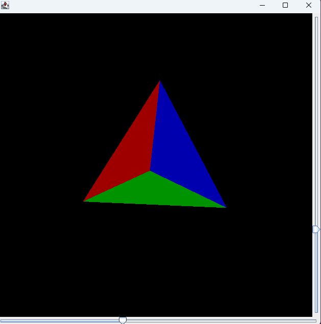

# 3D Renderer in Java

A software 3D render engine built from scratch in pure Java with no external dependencies.

## Features
- Matrix-based 3D rotation (heading and pitch)
- Barycentric coordinate rasterization
- Z-buffering for correct depth ordering
- Flat shading with gamma-corrected lighting
- Interactive rotation via sliders

## How to Run
1. Clone the repository
2. Compile: `javac DemoViewer.java`
3. Run: `java DemoViewer`

## Preview

## Based On
Tutorial by Rogach: